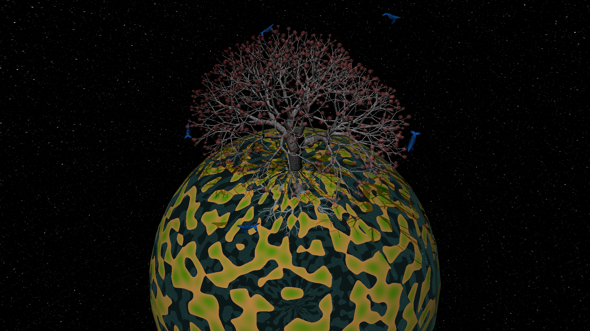

Assignments for the "Generative Gestaltung" (generative design) course
----------
Created with [Processing](https://processing.org/)

Assignment 1 was to use Java and [Processing](https://processing.org/) to manipulate an image.

Assignments 2-4 were in order:
1. Mandelbrot shader
2. procedural seashells
3. L-Systems

Assignment 5 was to create an procedural landscape. The team did not complete this assignment.

View the output using [Processing](https://processing.org/).

Arguably the most work-intesive and best-looking assignment was assignment 4, the world tree (L-Systems). 

